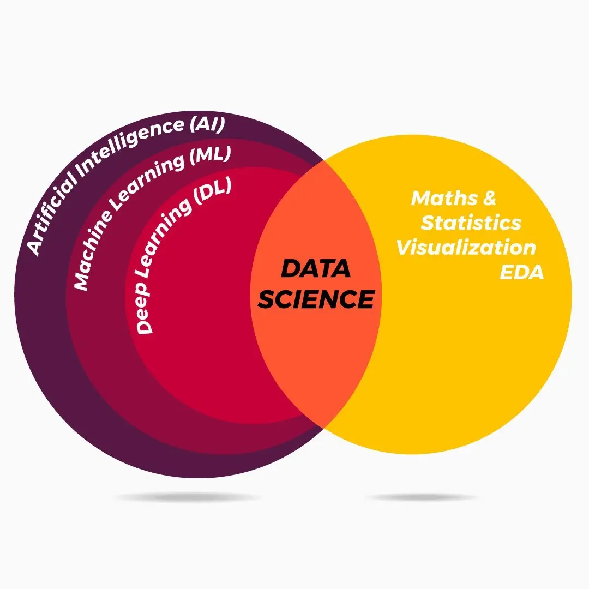

# Day-2

* On day 2, I learned about Artificial Intelligence.
* I also gained an understanding of the concepts of AI, Data Science, Machine Learning (ML), and Deep Learning (DL), and how they relate to each other.
***

***
* Furthermore, I learned which major companies are frequently utilizing AI technology.
* Finally, I learned how AI is changing our daily lives.